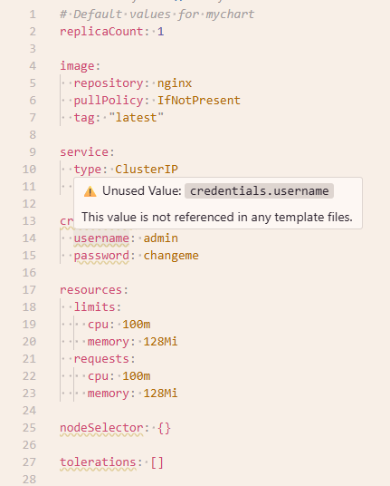

# Helm Highligth Unused Values - Syntax Highlighting for Helm
 
VS Code extension that highlights unused values in Helm `values.yaml` files.
 
## Features
 
- Automatically detects `values.yaml` files
- Scans corresponding `templates/` directory for value usage
- Highlights unused values with a curly underline
- Real-time updates as you edit
 
 
## Screenshots
 
Light theme



Dark theme


 
 
## Installation
 
1. Compile the extension:
   ```bash
   npm install
   npm run compile
   ```
 
2. Package and install:
   ```bash
   npx vsce package
   code --install-extension helm-highlight-unused-values-0.0.1.vsix
   ```
 
## Usage
 
Open any `values.yaml` file in a Helm chart. Unused values will be highlighted automatically.
 
## Uninstall
 
   ```bash
   code --uninstall-extension helm-highlight-unused-values
   ```
